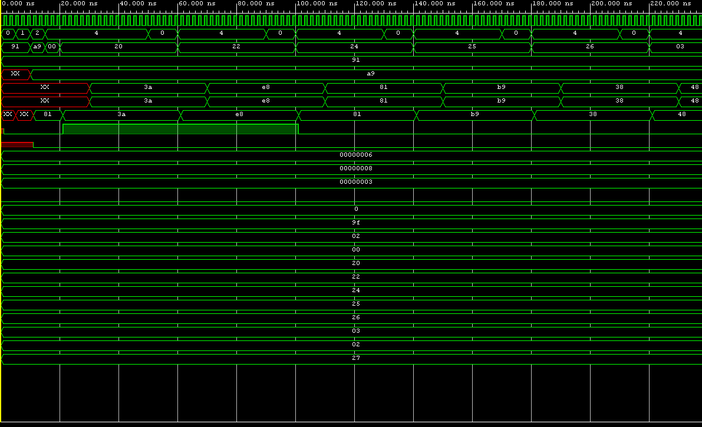
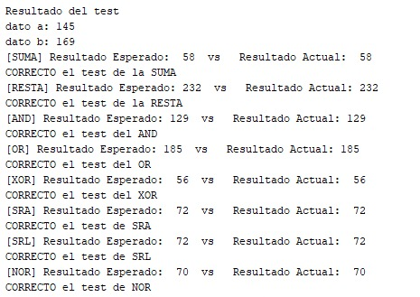

# TP1 ARQUITECTURA DE COMPUTADORAS

## Introduccion

Se debe implementar una ALU en una FPGA con las operaciones ADD, SUB, AND, OR, XOR, SRA, SRL, NOR. Esta ALU debe ser parametrizable por lo menos en el bus de datos. Ademas, se debe incluir un test bench que genere entradas aleatorias y checkee automaticamente si el resultado es correcto.

## Desarrollo

Se tienen 3 entradas en la ALU:

- Entrada de enables de 3 bits

- Entrada parametrizable

- El clock

La entrada de enables sirve para discriminar que se quiere hacer con la entrada parametrizable; esto es, **si los enables estan en 1**, se toma como que la entrada es el primer operado, **si los enables estan en 2**, se toma como que la entrada es el segundo operando, **y si los enables estan en 4**, se toma como que se esta intentando ingresar el codigo de operacion.

Basandose en el codigo de operacion, se hace un **case** y se guarda el resultado que corresponda en una variable de salida.

## Verificacion

Se intento generar una entrada aleatoria usando la funcion urandom, pero a menos que manualmente se cambie la seed de esta funcion, siempre genera el mismo valor. Para la verificacion automatica, simplemente se checkea que el/los valor/es random generado/s den correctamente el resultado esperado usando un **if**.

Se adjunta una imagen de los resultados de la simulacion.

